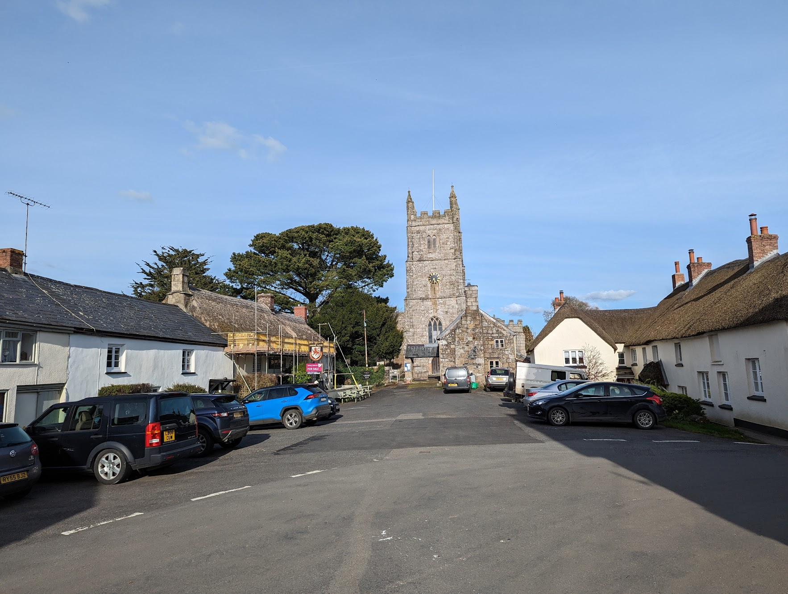

# Artificial Intelligence for Explorers

## AI tools to use for the challenges

### Chat bots

- [ChatGPT](https://chat.openai.com/) - Chat Bot - use it to create text, summarise text or invent ideas. Login with gmail address
- [Bard](https://bard.google.com/) - Google's Chat Bot. Login with gmail address.

### Image creation

- [DALL-E](https://labs.openai.com/) - Create an image from text. Login with gmail address
- [Scribbed Diffusion](https://scribblediffusion.com/) - Turn a sketch into an image. No login needed
- [This Person Does Not Exist](https://this-person-does-not-exist.com/en) - Generate a random face. No login needed
- Mid Journey - Amazing AI art, ask me
- [Stable Diffusion](https://stablediffusionweb.com/) - Image generation - not as good, but no login needed

### Translation

- [Google Translate](https://translate.google.co.uk/) - Translate text, or text in images or through camera. Login with gmail address

### Music creation

- [Sounddraw](https://soundraw.io) - Create music for different moods. No login needed

### Logo generation

- [Looka](https://looka.com/) - Generate business logos. No login needed

### Web site generation

- [Durable](https://durable.co/ai-website-builder) - Generate a web site in 30 seconds. No login needed

### Image manipulation examples

- [Deep Nostalgia](https://www.myheritage.com/deep-nostalgia) - Animate old photos. Login with gmail address
- [Cleanup.Pictures](https://cleanup.pictures/) - Magic eraser for photos. No login needed

### Videos / voice cloning

- [Deepbrain AI Studios](https://aistudios.com/dashboard) - Make a video presentation from text you provide, or let the AI create the text

## Challenges

### Rules

1. No human effort or creativity allowed!
2. Don’t spend too much time on each challenge - use AI to speed up the process!
3. Don’t upload any personal information or photos!

### Challenge 1

Solve this tough Maths puzzle: 

> Emily is 54 years old. Olivia, her mother, is 80 years old. How many years ago was Olivia exactly three times the age of her daughter?

_[1 point]_

### Challenge 2

You are on holiday in Egypt and you see this sign. What should you watch out for?

_[1 point]_

### Challenge 3

Which of these first 4 sentences of novels was made by a human, and which by an AI?

Excerpt 1:
> In the small, dingy cottage of the Blakemore family, nestled amidst a maze of narrow alleys, young Timothy Blakemore prepared himself for a journey unknown. The morning sun, casting feeble rays through the tattered curtains, illuminated the humble room where poverty had taken root. Amidst the creaking floorboards and threadbare blankets, Timothy's heart brimmed with a peculiar mixture of excitement and trepidation. For this day marked a turning point in his meager existence—the day he, a son of paupers, would venture into the realm of knowledge, the daunting abode of learning known as a school.

Excerpt 2:
> I visited Miss Havisham's house yesterday, and I found myself in a state of awe and bewilderment. As I stood at the threshold of that dilapidated mansion, its decaying grandeur and haunting atmosphere enveloped me. The air was thick with dust, as if time itself had settled upon the furniture and draped the faded tapestries. Through the broken windows, feeble rays of sunlight filtered in, illuminating the melancholic scene before me.

### Challenge 4

The Explorers group is having a summer camp involving caving and climbing. Create a design for a scout badge to celebrate the camp.

_[up to 3 points]_

### Challenge 5

It is your grandfather’s 70th birthday soon. Make him a birthday card picture featuring as many of the things he likes as possible! He loves steam trains. His favourite city is Paris. His favourite food is Cornish pasties. He adores his pet black cat. His favourite film is Star Wars. He loves art by Vincent van Gogh. 

_[up to 3 points]_

### Challenge 6

Your family are opening a new fish and chip shop in Cheriton Bishop. Invent an amusing name for the business, and create its logo

_[1 point for amusing name, 2 points for nice logo]_

### Challenge 7

You are putting on a short murder mystery play for GCSE Drama. 
Compose a 30 second piece of dramatic music to introduce the production.

_[up to 3 points]_

### Challenge 8

The new family fish and chip shop has opened! Create a web site to attract more customers.

_[up to 3 points]_

### Challenge 9

Remove all the cars from this picture of Drewsteignton

_[up to 2 points]_

